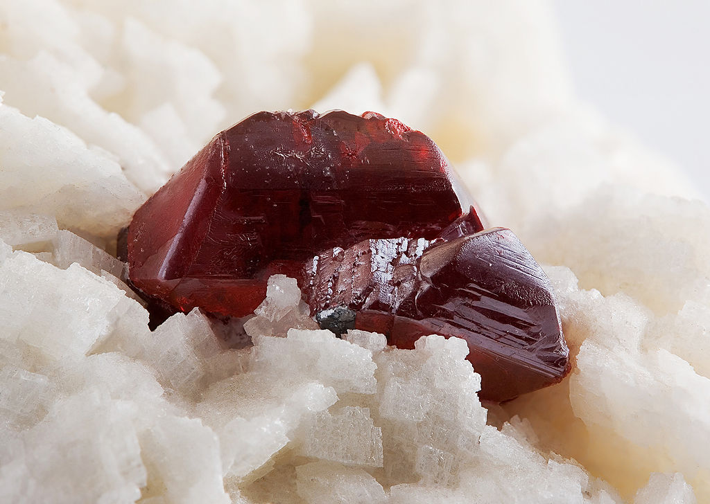
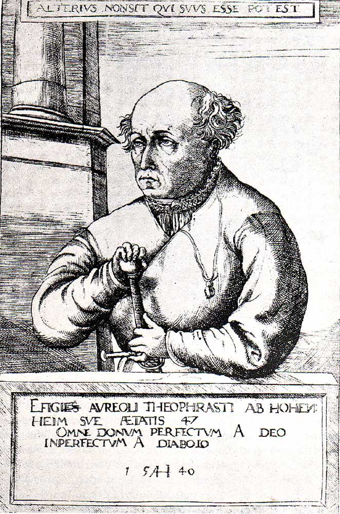
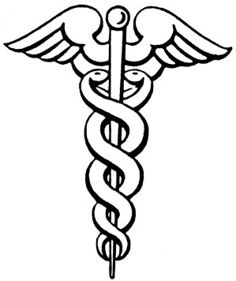
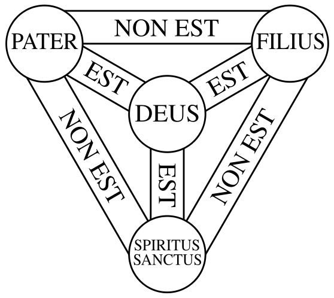
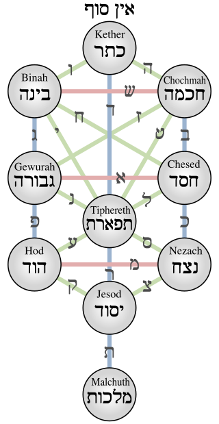

# 天地無用！ アドベントカレンダー2018

この記事は[天地無用！　アドベントカレンダー](https://adventar.org/calendars/2960)21日目の記事です。
他の記事も素晴らしいですので、ぜひ閲覧を。

## 免責事項

最初にお断りせねばなりませんが、この記事は非常にこじつけ臭い記事です。ぶっちゃけ[冷奴](https://dic.nicovideo.jp/a/%E5%86%B7%E5%A5%B4%28%E3%82%A2%E3%83%8B%E3%83%A1%E7%94%A8%E8%AA%9E%29 "ニコニコ大百科「冷奴（アニメ用語）」")です。今流行りの解釈違いが大いに起こりえますので、是非ツッコミください。
なお、筆者はOVA1期2期と小説版が中心で、聖典たる同人誌も全然入手できておりませんので、間違い等ありましたら生暖かくツッコンでいただけると幸いです。

## はじめに

天地無用！　は、言わずとしれた人気アニメシリーズです。その世界観は重厚で、一口で説明するのであれば「和風スペオペ」であります。
しかしながら、趣味でオカルティストをしている私には、いくつか西洋的なオカルト要素にこじつけられる要素があり、矢も盾もたまらずこの**怪文書**を書くに至りました。
ご笑覧いただけたら幸いです。

## 宝玉

最初に語りたい点は、はじめに鷲羽ちゃんが持ち、魎呼が、そして天地が持つようになった宝玉です。
その形は丸く、ほんのりと紅く、そして魎呼や天地剣を通じて船穂へと力を供給し続けているアイテムであり、魎呼が3つ持てば津名魅にも匹敵する力を引き出せるとされています。
真天地1巻の表紙はなんと神々しいことでしょうか！  
しかしそんな宝玉ですが、その機能や逸話、そして見た目から、どうしても連想せざるを得ないものがオカルト界に存在しています。それが、かの名高き「賢者の石」です。  
賢者の石という名前を、フィクションを好む方なら一度は耳にしたことがあるかと思います。恐らく最も有名なものは、世界的人気小説シリーズ「ハリー・ポッターシリーズ」の最初の単行本「ハリー・ポッターと賢者の石」でしょう。また漫画「からくりサーカス」の中でもキーアイテム「柔らかい石」「アクアウィタエ」という別名で登場しています（正確には、アクアウィタエは少々違うのですが、ヘルメス哲学的には近いものです）。  
　（JJ Harrison <https://www.jjharrison.com.au/> CC-BY-SA3.0）*[辰砂](https://ja.wikipedia.org/wiki/%E8%BE%B0%E7%A0%82 "Wikipedia「辰砂」")。賢者の石の見た目の元ネタとされ、賢者の石と同一視される中国金丹術の「丹」とも扱われる。水銀化合物。*  
錬金術の極地としてしられる賢者の石の詳細について語り始めると長くなりますので、詳しくは[Wikipedia](https://ja.wikipedia.org/wiki/%E8%B3%A2%E8%80%85%E3%81%AE%E7%9F%B3 "Wikipedia「賢者の石」")を参照いただくとして、その性質のうち特筆すべき点として、その見た目と効能を挙げることができます。誉れ高い賢者の石はルベド（赤化）という工程を経て紅く輝く石として知られており、その為に「赤い石」の異名を持っております。またその作用は「全てを癒やし、金へと物質を変性させ、その作者を神の領域へと導く」という物であり、魎呼の再生力や物質変換能力（神我人戦で見せたような）を彷彿とさせます。  
さらに、錬金術の奥義としての賢者の石は民間伝承に下るにつれ、色々と機能が追加されていきます。その中のもので代表的なものを取り上げると「魔力が増強される」「霊を使役することができる（パラケルススのAZOTH剣など）」「空を飛ぶことができる」「姿が透明になる」など、魎呼ちゃんの特殊能力との相似点が際立っていると言えるでしょう。

　(PUBLIC DOMAIN)　*AZOTH剣を持つパラケルスス*

## 鷲羽ちゃん（と白眉家、被造物）

では、その宝玉のもとの持ち主で、魎呼ちゃんや魎皇鬼ちゃん、神我人などを創り出した鷲羽ちゃんはどうでしょうか。
結論から言うと、鷲羽のキャラクター性には極めて強い錬金術師性が見え、そのモデルに[パラケルスス](https://ja.wikipedia.org/wiki/%E3%83%91%E3%83%A9%E3%82%B1%E3%83%AB%E3%82%B9%E3%82%B9 "Wikipedia「パラケルスス」")や、[ヘルメス＝トリスメギストス](https://ja.wikipedia.org/wiki/%E3%83%98%E3%83%AB%E3%83%A1%E3%82%B9%E3%83%BB%E3%83%88%E3%83%AA%E3%82%B9%E3%83%A1%E3%82%AE%E3%82%B9%E3%83%88%E3%82%B9 "Wikipedia「ヘルメス・トリスメギストス」")の姿を見ることができます。  
真理を探求したりするマッドサイエンティスト的な姿に錬金術師の姿を当てはめることは古典的に行われておりますが、中でも鷲羽は「謎と神秘に満ちた誕生」「医師としての姿を強調する（パラケルスス）」「ホムンクルスを作る」という所に錬金術の残滓を見ることができるでしょう。特に双蛇（もちろん元ネタは聖地岡山県[総社市](https://ja.wikipedia.org/wiki/%E7%B7%8F%E7%A4%BE%E5%B8%82 "Wikipedia「総社市」")ですが、これも[ウロボロス](https://ja.wikipedia.org/wiki/%E3%82%A6%E3%83%AD%E3%83%9C%E3%83%AD%E3%82%B9 "Wikipedia「ウロボロス」")を連想させる名前です）に封印されていたときの「翼のモチーフと、それを囲む2つの蛇」という封印（？）は、ヘルメス・トリスメギストス（メルクリウス）が持つとされる[ケーリュケイオンの杖](https://ja.wikipedia.org/wiki/%E3%82%B1%E3%83%BC%E3%83%AA%E3%83%A5%E3%82%B1%E3%82%A4%E3%82%AA%E3%83%B3 "Wikipedia「ケーリュケイオン」")のシンボルと似ているのではないでしょうか。  
　（PUBLIC DOMAIN）　*ケーリュケイオン（カドケウス）の杖。ヘルメスの持ち物。*  
また、一般にも知られているように錬金術師は[ホムンクルス](https://ja.wikipedia.org/wiki/%E3%83%9B%E3%83%A0%E3%83%B3%E3%82%AF%E3%83%AB%E3%82%B9 "Wikipedia「ホムンクルス」")を作るものとされています（これは「キリスト教的原罪を持たない純粋な存在であるホムンクルス」を作ることで真理にたどり着く為と言われています）。出生に関しては白眉家と神我人にも当てはまりますが、その素材に「万素」を利用した、という点も見逃せないポイントです。錬金術の思想では、万物に共通した根源的な素材「[プリマ・マテリア](https://ja.wikipedia.org/wiki/%E7%AC%AC%E4%B8%80%E8%B3%AA%E6%96%99 "Wikipedia「第一質料」")」が存在していると考えており、その字面は正に万素という文字に相応しいものです。そしてそのプリマ・マテリアを抽出し、腐敗させ、蘇生させて、赤く変容させることで賢者の石が産まれるとされているので、宝玉の持ち主が魎呼であり（あった）、そして神である鷲羽ちゃんが持ち主であった、ということは極めて自然のように思えます。またホムンクルスの生成について記述した始祖が、先に述べたパラケルススであるということも注目すべきでしょう。  
神我人が雌雄同体であったという点も興味深いポイントです。なぜなら、男女の交合もまた完全性を得るために起こりうる事態だとされており、錬金術の絵においては[両性具有](https://ja.wikipedia.org/wiki/%E4%B8%A1%E6%80%A7%E5%85%B7%E6%9C%89 "Wikipedia「両性具有」")が頻繁に登場しているからです。  
　（PUBLIC DOMAIN）　*「黄金の卓の象徴(*Symbola Aureae Mensae*)」([Michael Maier](https://en.wikipedia.org/wiki/Michael_Maier?uselang=ja "Wikipedia「Michael Maire」"))に現れる両性具有者、と[アルベルトゥス・マグヌス](https://ja.wikipedia.org/wiki/%E3%82%A2%E3%83%AB%E3%83%99%E3%83%AB%E3%83%88%E3%82%A5%E3%82%B9%E3%83%BB%E3%83%9E%E3%82%B0%E3%83%8C%E3%82%B9 "Wikipedia「アルべルトゥス・マグヌス」")*  
鷲羽ちゃんが3つの姿で有名（神、銀河アカデミーの天才、全銀河のバランスを容易に崩し得る樹雷からみた軍事的脅威）であることにも意味を見出すことが可能です。錬金術師の始祖ヘルメス・トリスメギストスは、神とも人とも言えない存在として知られておりますが、彼の名「トリスメギストス」は「3重に偉大な」という意味を表しており、それは「ギリシャ神話の[ヘルメス](https://ja.wikipedia.org/wiki/%E3%83%98%E3%83%AB%E3%83%A1%E3%83%BC%E3%82%B9 "Wikipedia「ヘルメース」")・ローマ神話の[メルクリウス](https://ja.wikipedia.org/wiki/%E3%83%A1%E3%83%AB%E3%82%AF%E3%83%AA%E3%82%A6%E3%82%B9 "Wikipedia「メルクリウス」")・エジプト神話の[トート](https://ja.wikipedia.org/wiki/%E3%83%88%E3%83%BC%E3%83%88 "Wikipedia「トート」")」と言われております。また色々と姿を変える点も、錬金術師[フルカネッリ](https://en.wikipedia.org/wiki/Fulcanelli "Wikipedia「Fulcanelli」")はそのように人前に現れたそうです。

## ３という数

錬金術の触りの部分と、著名な錬金術師と鷲羽ちゃんとの類似点を挙げてきましたが、錬金術の始祖たるヘルメス・トリスメギストスの「３重」の様に、３という数字は重要な数字です。  
キリスト教神学においては「[父](https://ja.wikipedia.org/wiki/%E3%83%A4%E3%83%8F%E3%82%A6%E3%82%A7 "Wikipedia「ヤハウェ」")・[子](https://ja.wikipedia.org/wiki/%E3%82%A4%E3%82%A8%E3%82%B9%E3%83%BB%E3%82%AD%E3%83%AA%E3%82%B9%E3%83%88 "Wikipedia「イエス・キリスト」")・[聖霊](https://ja.wikipedia.org/wiki/%E8%81%96%E9%9C%8A "Wikipedia「聖霊」")」の[三位一体](https://ja.wikipedia.org/wiki/%E4%B8%89%E4%BD%8D%E4%B8%80%E4%BD%93 "Wikipedia「三位一体」")が重要視されていることが日本でも有名でありますし、その日本神話においても「[天照大御神](https://ja.wikipedia.org/wiki/%E5%A4%A9%E7%85%A7%E5%A4%A7%E7%A5%9E "Wikipedia「天照大神」")・[月讀命](https://ja.wikipedia.org/wiki/%E3%83%84%E3%82%AF%E3%83%A8%E3%83%9F "Wikipedia「ツクヨミ」")・[須佐之男命](https://ja.wikipedia.org/wiki/%E3%82%B9%E3%82%B5%E3%83%8E%E3%82%AA "Wikipedia「スサノオ」")」による[三貴神](https://ja.wikipedia.org/wiki/%E4%B8%89%E8%B2%B4%E5%AD%90 "Wikipedia「三貴子」")が、そしてギリシャ神話においても「[ゼウス](https://ja.wikipedia.org/wiki/%E3%82%BC%E3%82%A6%E3%82%B9 "Wikipedia「ゼウス」")・[ポセイドーン](https://ja.wikipedia.org/wiki/%E3%83%9D%E3%82%BB%E3%82%A4%E3%83%89%E3%83%BC%E3%83%B3 "Wikipedia「ポセイドーン」")・[ハーデース](https://ja.wikipedia.org/wiki/%E3%83%8F%E3%83%BC%E3%83%87%E3%83%BC%E3%82%B9 "Wikipedia「ハーデース」")」の兄弟神が最高位に鎮座しております。北欧神話などでも見られるこの「３」という構図は、無論３になっているものを取り出しただけのチェリーピッキングではありますが、それでも無視できないほど頻出し、そして重要な位置にいる数です。  
　（PUBLIC DOMAIN)　*キリスト教における「三位一体の盾」*  
そしてそれは、我らが天地無用！　の世界でもその姿を見せています。脚本の都合と言ってしまえばそりゃそうなんですが。例えばメインヒロインの構図「天地・魎呼・阿重霞」樹雷皇の夫婦「阿主沙・船穂・美砂樹」真天地無用の巻数（これは増えてほしい）etcetc……そして先に上げた宝玉の数、光鷹翼の（基本的な）数、そして三命の頂神の数とも対応しております。  
ここで、ヘブライ・オカルティズム（[カバラー思想](https://ja.wikipedia.org/wiki/%E3%82%AB%E3%83%90%E3%83%A9 "Wikipedia「カバラ」")）に多用される[生命の樹](https://ja.wikipedia.org/wiki/%E7%94%9F%E5%91%BD%E3%81%AE%E6%A8%B9 "Wikipedia「生命の樹」")を出したいと思います。  
　（PUBLIC DOMAIN）　*生命の樹*  
エヴァシリーズでお馴染みの、セフィロトの樹とも呼ばれるそれですが、その構成要素は10あるセフィラとそれらをつなぐ22のパスです。10という数字に津名魅様の光鷹翼を彷彿とさせますが、そのセフィラのうち先頭の3つを切り出すと、不思議と三命の頂神と対応しているような気がしないでしょうか。

1. Keter（ケテル）　「王冠」　樹雷の始祖神として王位を司る津名魅様　（最近[SCP財団](http://ja.scp-wiki.net/ "SCP財団")で[人気](http://ja.scp-wiki.net/object-classes#toc3 "オブジェクトクラス--Keter")）  
1. Chokhmah（コクマー）　「知恵」　宇宙史上最高の知恵の持ち主である鷲羽ちゃん  
1. Binah（ビナー）　「理解」　訪希深様なんだけど……うーん、まあ、うん、ねえ、争いからってパターンで、ねぇ（無理やり）  

とまあ、こんなふうに（無理やりを横目にしつつ）できるのではないかなと。  
ところで、日本語の熟語で3（文字）で世界を表す言葉に「[天地人](https://ja.wikipedia.org/wiki/%E4%B8%89%E6%89%8D "Wikipedia「三才」")」というものがあります。「バッ活」「ラジオライフ」「ゲームラボ」でお馴染み「三才ブックス」の三才でありますが、これを宝玉と組み合わせると、2話の「魎呼が天地剣から宝玉を1個返してもらう」シーンが面白く見えてきます。あの、やたらと尺があるシーンによって、天地剣は正しく天地のものとなり、そして魎呼は破壊魔から人になった、のではないかと解釈できるのです。まあ、冷奴も硬すぎて人を殴り殺せそうなレベルの妄言ではありますが。

## 名前文字

先程出てきたカバラーの秘法の中に「[テムラー](https://en.wikipedia.org/wiki/Temurah_(Kabbalah) "Wikipedia「Temurah(Labbalah)」")」というものがあります。これは「[ゲマトリア](https://ja.wikipedia.org/wiki/%E3%82%B2%E3%83%9E%E3%83%88%E3%83%AA%E3%82%A2 "Wikipedia「ゲマトリア」")」（数秘術。ヘブライ文字を数字に変えて、それによって意味を見出す）「[ノタリコン](https://ja.wikipedia.org/wiki/%E3%83%8E%E3%82%BF%E3%83%AA%E3%82%B3%E3%83%B3 "Wikipedia「ノタリコン」")」（アクロニムやバクロニムに近い）と並んでカバラーのヘブライ文字遊びの一つなのですが、このテムラーの技法の中に「複数の文字をまとめ上げて一つのシンボルにする」というものがあります。私が見たことがあるものでは、天使の名前（熾天使の誰かだったと思うんですが）を一つのシンボルにまとめ上げた護符、というものがありました。  
この手法、天地無用！ 世界の「名前文字」と似ていませんか？　推しの名前文字くらいかけますよね？（私は魎呼ちゃんのものならいつでも書けます）

## 本当に関係のない話

本稿を書くにあたって資料をあたっていたところ、辰砂が2016年に三重県の「県の鉱物」として指定された事を知りました。ヘルメス・トリスメギストス哲学が日本にも定着したんですね（違

## おわりに

以上、怪文書でした。**全部こじつけ**です！　ごめんなさい！！  
まだまだこじつけ足りないのですが、もしまたご興味があればお声掛けしてください。  
駄文妄想文失礼しました。

でとこーだ([@detcoder](https://twitter.com/detcoder?lang=ja "ついったぁ"))
